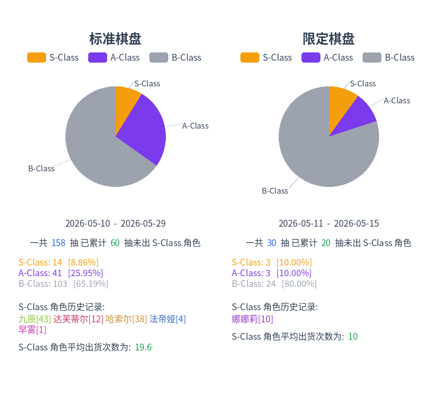

# NTE Dice Analysis

Language: English | [中文](./README.md)

Use OCR to parse NTE gacha record screenshots into JSON, then generate XLSX
and PNG reports.

Example output:



The UI is modeled after
[StarRailWarpExport](https://github.com/biuuu/star-rail-warp-export).

Most of the code was written by Codex.

Currently, only game screenshots in Simplified Chinese can be processed.

## Usage

The pipeline is intentionally split into separate steps so OCR and export
issues can be debugged through intermediate files.

Crop a full screenshot into a table image:

```bash
uv run nte-crop 2026-05-25_21-06-03_NTE.png
```

By default, this writes a cropped table image beside the source screenshot. The
pool type is recognized from the fixed dropdown crop region and included in the
filename:

```text
2026-05-25_21-06-03_NTE.table.标准棋盘.png
```

Recognize the cropped table image into a per-image JSON file:

```bash
uv run nte-recognize 2026-05-25_21-06-03_NTE.table.标准棋盘.png
```

By default, this writes:

```text
2026-05-25_21-06-03_NTE.table.标准棋盘.json
```

Export recognized JSON files into a deduplicated XLSX workbook:

```bash
uv run nte-export-xlsx *.table.*.json --xlsx-out records.xlsx
```

You can also export a PNG summary:

```bash
uv run nte-export-png *.table.*.json --png-out records.png
```

You can pass files or directories. Directories are expanded in sorted order.
`nte-crop` expands supported image files; `nte-recognize` expands cropped table
images with `.table.` in the filename; `nte-export-xlsx`, `nte-export-png`, and
`nte-check-known-items` expand JSON files. `nte-crop` and `nte-recognize` skip
existing deterministic outputs by default; pass `--overwrite` to regenerate
them.

The OCR commands default to `--device auto`: when Paddle is built with CUDA and
can see a GPU, `gpu:0` is used; otherwise CPU is used. PaddleX automatically
resolves and downloads the default PP-OCRv5 server detection and recognition
models. Use `--det-model-dir` or `--rec-model-dir` only when pointing at an
existing local model directory.

The default crop parameters are tuned for 3840x2160 Windows game client
screenshots. If the game window size or table position changes, adjust the crop
region:

```bash
uv run nte-crop sample.png --table-crop 0.1823,0.4259,0.8281,0.7870
```

`--table-crop` accepts either normalized coordinates from `0` to `1`, or pixel
coordinates. `--pool-crop` works the same way for cropping the `棋盘类型`
dropdown, and its result is used as the pool type in cropped filenames.

The `rarity` output column is detected from the item-name text color: gold is
`S-Class`, purple is `A-Class`, and gray is `B-Class`.

The XLSX workbook creates one worksheet per `pool_type`, displays records
oldest-first, splits item type and item name into separate columns, adds
`稀有度`, `保底内`, and `总抽数`, and colors rows by rarity.

The PNG summary creates one panel per `pool_type`, including a rarity pie
chart, total pull count, current pulls since the latest S-Class character,
S-Class character history, and average pulls per S-Class character.

`nte-recognize` does not deduplicate. `nte-export-xlsx` and `nte-export-png`
deduplicate after loading all JSON files. The merge keeps the reverse
chronological table order, aligns overlapping screenshots by pool type,
timestamp, and row content, treats single-pull timestamps as one record or one
record plus `集点赠礼`, and requires ten-pull timestamps to include 10 pulls plus
one `集点赠礼`. Missing timestamps or invalid pull groups stop the export so the
source crop/OCR issue can be investigated.

## Development and Maintenance

Run the unit tests:

```bash
uv run pytest
```

The project includes a `known_items.txt` file for correcting possible OCR
errors. Check whether recognized JSON files contain item names that are missing
from `known_items.txt`:

```bash
uv run nte-check-known-items *.table.*.json
```

This file needs to be updated as the gacha pools are updated.
