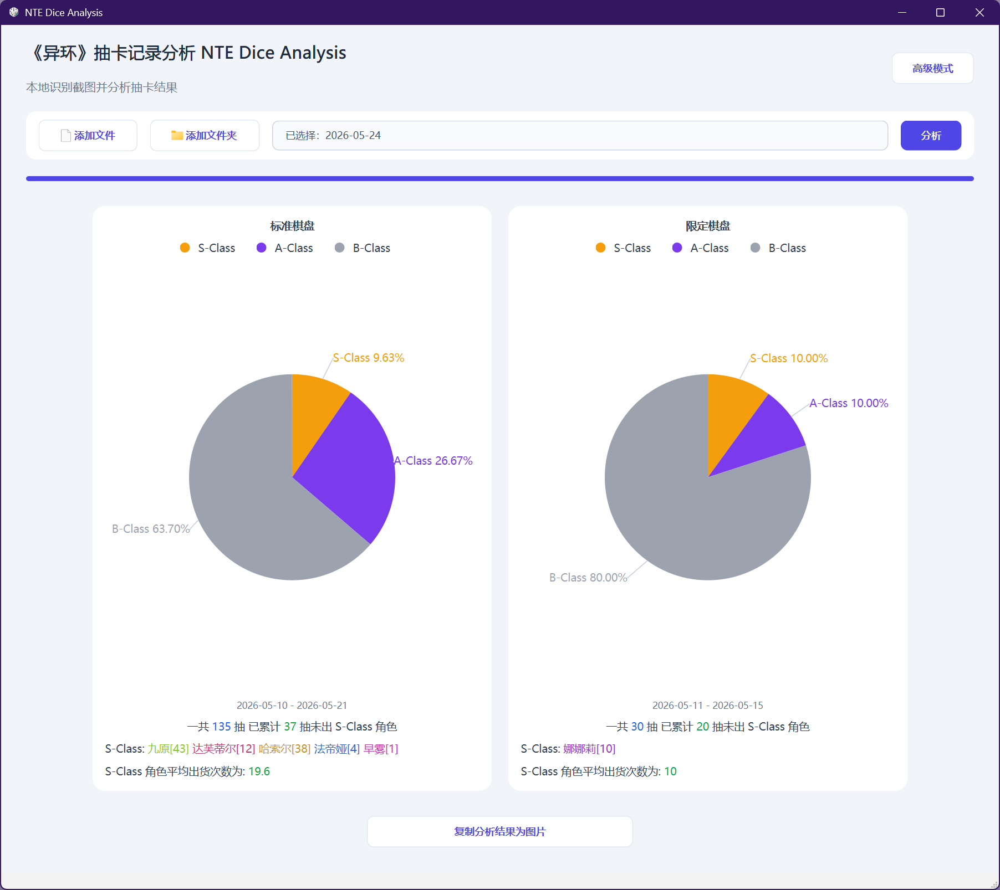
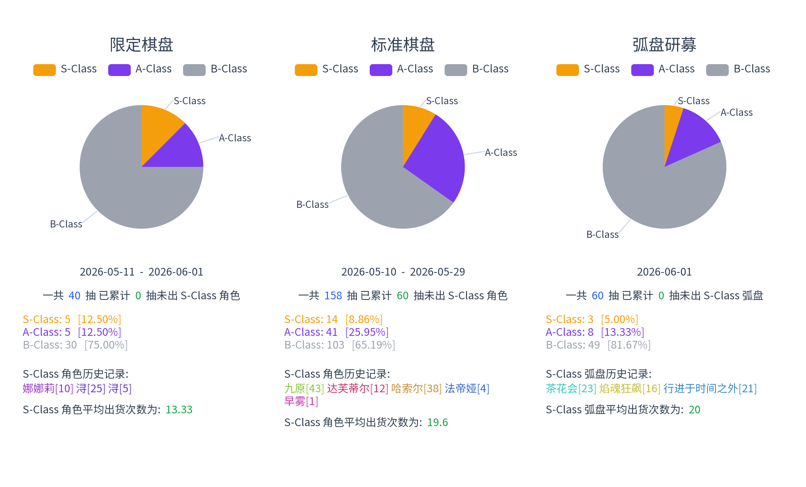
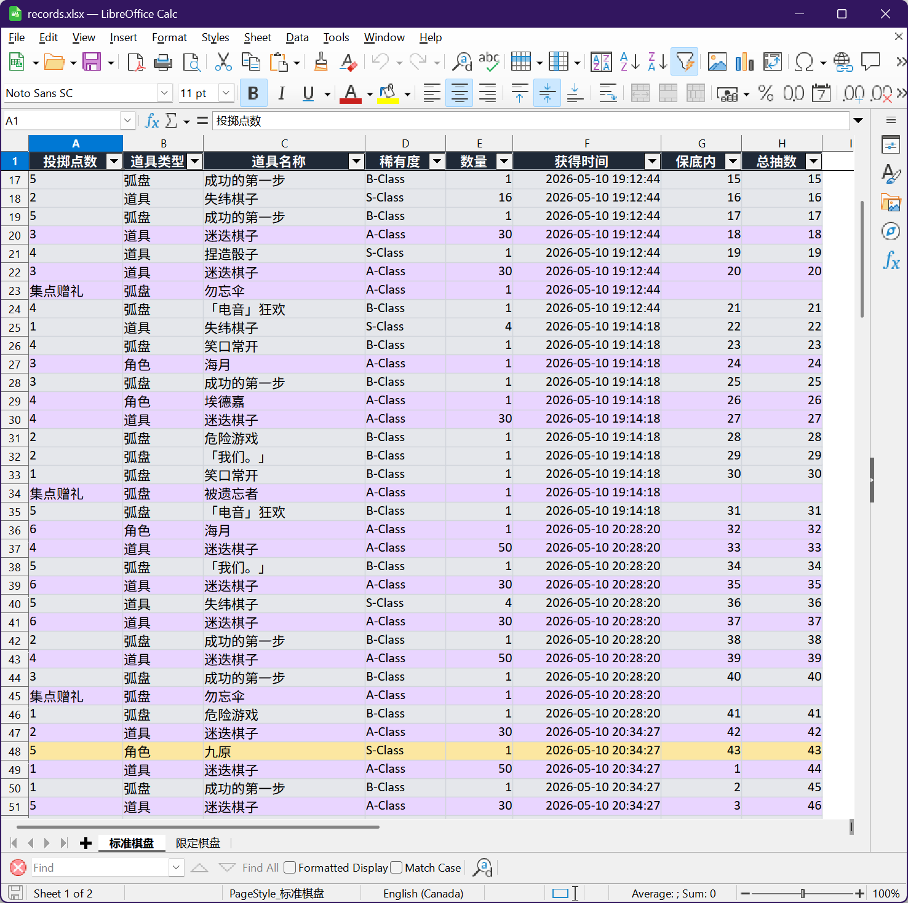

# NTE Dice Analysis 异环抽卡记录分析

<p align="center">
  
</p>

把《异环》的抽卡记录截图整理成两个文件：

- `records.xlsx`：Excel 表格
- `records.png`：抽卡汇总图片

目前只支持简体中文版本的游戏截图。

程序界面：



汇总图片输出示例（设计参考了 [StarRailWarpExport](https://github.com/biuuu/star-rail-warp-export)）：



Excel 表格输出示例：




## Windows 快速使用

1. 打开 [Releases](https://github.com/wzyboy/nte-dice-analysis/releases) 页面。
2. 下载 `NTE-Dice-Analysis-windows-x64-vX.Y.Z.zip`。
3. 解压这个 ZIP。
4. 双击 `NTE Dice Analysis.exe`。
5. 在 `简单` 标签页添加完整的游戏截图。
6. 保持默认输出文件夹，或选择你想保存结果的位置。
7. 点击 `开始分析`。
8. 完成后，点击 `打开 XLSX`、`打开 PNG` 或 `打开文件夹` 查看结果。

默认情况下，结果会保存到 Windows 文档目录下的 `nte-dice-analysis` 文件夹。

常见文件：

- `records.xlsx`：Excel 表格
- `records.png`：汇总图片
- 裁剪后的表格图片和 JSON 文件：用于下次复用，也方便排查 OCR 问题
- `logs` 文件夹：运行日志

如果程序报错，可以点击 `打开日志文件`，或查看：

```text
Documents\nte-dice-analysis\logs\nte-dice-analysis.log
```

## 使用提示

- 请在 `简单` 标签页添加完整游戏截图，不需要自己提前裁剪。
- OCR 使用 CPU，截图多的时候需要等一会儿。
- Windows 便携版已经内置默认 OCR 模型，正常情况下首次运行也不需要下载模型。
- `高级` 里的 `裁剪`、`识别`、`导出` 标签页主要用于调试，不是普通使用必需的步骤。

## 命令行 / Linux 使用

从源码运行：

```bash
uv run nte-gui
```

也可以分别运行裁剪、识别和导出命令：

```bash
uv run nte-crop --help
uv run nte-recognize --help
uv run nte-export-xlsx --help
uv run nte-export-png --help
```

## 开发

运行测试：

```bash
uv run pytest
```

构建 Windows 便携版 ZIP：

```powershell
.\scripts\build_windows.ps1
```

`src/nte_dice_analysis/known_items.txt` 用于修正 OCR 中可能出现的物品名错误，卡池更新后可能也需要更新。
